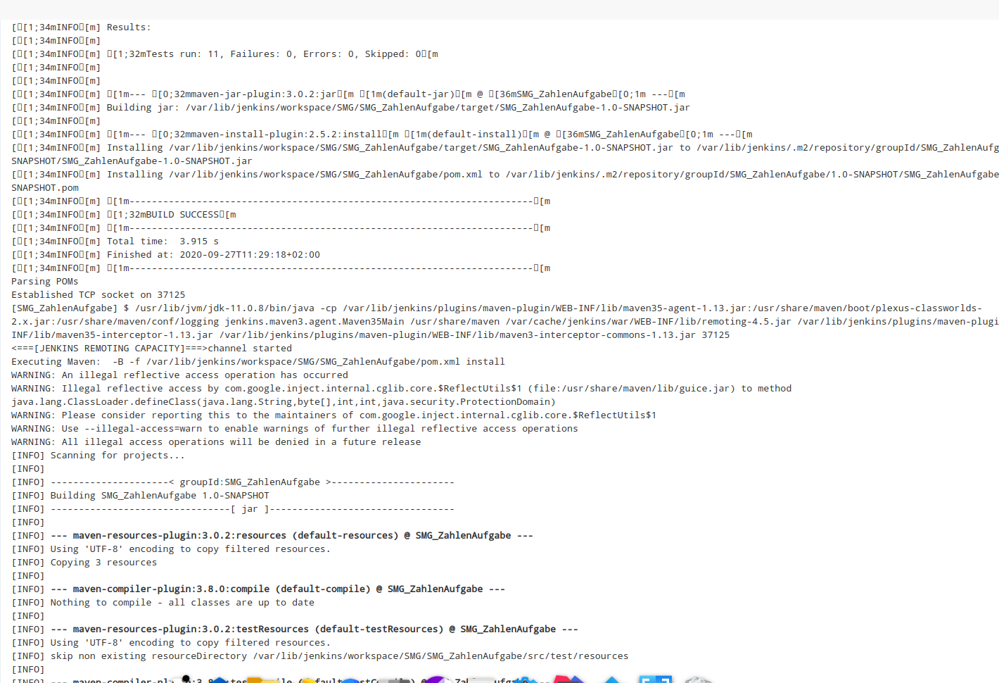

# Aenderungsverlauf

[master (Root-Commit) d596c99] "Anfaenglicher commit fuer SMG_ZahlenAufgaben"
 2 files changed, 19 insertions(+)
 create mode 100644 SMG_ZahlenAufgabe/README.md
 create mode 100644 SMG_ZahlenAufgabe/src/App.java
 
[master 1e6368d] "Rational.java und Zahl.java wurden zu "numbers" eingefuegt"
 2 files changed, 219 insertions(+)
 create mode 100644 SMG_ZahlenAufgabe/src/numbers/Rational.java
 create mode 100644 SMG_ZahlenAufgabe/src/numbers/Zahl.java

[master a1dc0bc] "Ueberschrift "Ihre Eingabe:" geaendert zu "Ergebniss:" in eingabe()"
 1 file changed, 1 insertion(+), 1 deletion(-)

[master f77148b] "Method main wurde fuer die Eingabe und Ausgabe von Bruch implementiert"
 1 file changed, 6 insertions(+), 1 deletion(-)

git tag release1 -m Erstellen von "release1"

 ## Zusammenfassung: Erste Aufgabe
 Zu Beginn wurde das Projekt von https://github.com/MBrill/ZahlenAufgabe.git. runtergeladen und die relevante *.java - Dateien nach neu angelegten Project SMG_ZahlenAufgabe kopiert und angepasst.
 Als nächstes wurde die Main - Methode in App.java fuer die Eingabe von Bruch und deren Kuerzen angepasst dabei wurde nur die eingabe() von Rational.java verwendet sowie paar Ueberschriften am Anfang und Ende
 der Main mit System.out eingefuegt. Die Ueberschft in eingabe() von Rational.java wurde von "Ihre Eingabe:" zu "Ergebniss:" geaendert.

Anschliesslich wurde "release1" mit "git tag" - command erstellt und hochgeladen.

## Aenderungsverlauf

[doxygen 614a83f] "Ordner "Dokumentation" ist mit Unterordner "Bilder" und logo.png eingefuegt"
 1 file changed, 0 insertions(+), 0 deletions(-)
 create mode 100644 Dokumentation/Bilder/bruch.png

[doxygen 92e2283] "Einfuegen von JavaDoc Kommentare zu Relational.java"
 1 file changed, 82 insertions(+), 11 deletions(-)

[doxygen 86c36d8] "Einfuegen von JavaDoc Kommentare zu Zahl.java"
 1 file changed, 10 insertions(+), 3 deletions(-)

[doxygen 91f4c1f] "Einfuegen von Klassenbeschreibung zu Rational.java"
 1 file changed, 8 insertions(+), 1 deletion(-)

[doxygen 1bd484b] "Einfuegen von Kommentaren fuer die Erstellung Mainpages and Example"
 1 file changed, 33 insertions(+), 3 deletions(-)

[doxygen 78139ba] "Schreibfehlerkorrektur bei den Komentaren"
 1 file changed, 5 insertions(+), 5 deletions(-)

[doxygen 867d588] "Hinzufuegen von bruch_demo.gif zu "Bilder""
 1 file changed, 0 insertions(+), 0 deletions(-)
 create mode 100644 Dokumentation/Bilder/bruch_demo.gif

[doxygen 6d8cd0f] "Speichern von Doxygen -  Einstellungen, als Doxyfile in Dokumnetation"
 1 file changed, 2579 insertions(+)
 create mode 100644 Dokumentation/Doxyfile

[doxygen 8e8ad69] "Erstellen von Dokumentation fuer SMG_ZahlenAufgabe"
 155 files changed, 9042 insertions(+)
 create mode 100644 Dokumentation/SMG_ZahlenAufgabe_Dokumentation/_app_8java-example.html
 create mode 100644 Dokumentation/SMG_ZahlenAufgabe_Dokumentation/_app_8java.html
 create mode 100644 Dokumentation/SMG_ZahlenAufgabe_Dokumentation/_app_8java_source.html
 create mode 100644 Dokumentation/SMG_ZahlenAufgabe_Dokumentation/_r_e_a_d_m_e_8md.html
 create mode 100644 Dokumentation/SMG_ZahlenAufgabe_Dokumentation/_rational_8java.html
 create mode 100644 Dokumentation/SMG_ZahlenAufgabe_Dokumentation/_rational_8java_source.html
 create mode 100644 Dokumentation/SMG_ZahlenAufgabe_Dokumentation/_zahl_8java.html
 create mode 100644 Dokumentation/SMG_ZahlenAufgabe_Dokumentation/_zahl_8java_source.html
 create mode 100644 Dokumentation/SMG_ZahlenAufgabe_Dokumentation/annotated.html
 create mode 100644 Dokumentation/SMG_ZahlenAufgabe_Dokumentation/bc_s.png
 create mode 100644 Dokumentation/SMG_ZahlenAufgabe_Dokumentation/bdwn.png
 create mode 100644 Dokumentation/SMG_ZahlenAufgabe_Dokumentation/bruch.png
 create mode 100644 Dokumentation/SMG_ZahlenAufgabe_Dokumentation/bruch_demo.gif
 create mode 100644 Dokumentation/SMG_ZahlenAufgabe_Dokumentation/class_app-members.html
 create mode 100644 Dokumentation/SMG_ZahlenAufgabe_Dokumentation/class_app.html
 create mode 100644 Dokumentation/SMG_ZahlenAufgabe_Dokumentation/classes.html
 create mode 100644 Dokumentation/SMG_ZahlenAufgabe_Dokumentation/classnumbers_1_1_rational-members.html
 create mode 100644 Dokumentation/SMG_ZahlenAufgabe_Dokumentation/classnumbers_1_1_rational.html
 create mode 100644 Dokumentation/SMG_ZahlenAufgabe_Dokumentation/classnumbers_1_1_rational__inherit__graph.map
 create mode 100644 Dokumentation/SMG_ZahlenAufgabe_Dokumentation/classnumbers_1_1_rational__inherit__graph.md5
 create mode 100644 Dokumentation/SMG_ZahlenAufgabe_Dokumentation/classnumbers_1_1_rational__inherit__graph.png
 create mode 100644 Dokumentation/SMG_ZahlenAufgabe_Dokumentation/classnumbers_1_1_zahl-members.html
 create mode 100644 Dokumentation/SMG_ZahlenAufgabe_Dokumentation/classnumbers_1_1_zahl.html
 create mode 100644 Dokumentation/SMG_ZahlenAufgabe_Dokumentation/classnumbers_1_1_zahl__inherit__graph.map
 create mode 100644 Dokumentation/SMG_ZahlenAufgabe_Dokumentation/classnumbers_1_1_zahl__inherit__graph.md5
 create mode 100644 Dokumentation/SMG_ZahlenAufgabe_Dokumentation/classnumbers_1_1_zahl__inherit__graph.png
 create mode 100644 Dokumentation/SMG_ZahlenAufgabe_Dokumentation/closed.png
 create mode 100644 Dokumentation/SMG_ZahlenAufgabe_Dokumentation/dir_2fac444509dc8a3d8ca9e2d37a99d4c5.html
 create mode 100644 Dokumentation/SMG_ZahlenAufgabe_Dokumentation/dir_76f8028f54cae192c4299df00fb7e367.html
 create mode 100644 Dokumentation/SMG_ZahlenAufgabe_Dokumentation/dir_b095e8da1e13f652483a44c27babc8c7.html
 create mode 100644 Dokumentation/SMG_ZahlenAufgabe_Dokumentation/doc.png
 create mode 100644 Dokumentation/SMG_ZahlenAufgabe_Dokumentation/doxygen.css
 create mode 100644 Dokumentation/SMG_ZahlenAufgabe_Dokumentation/doxygen.svg
 create mode 100644 Dokumentation/SMG_ZahlenAufgabe_Dokumentation/dynsections.js
 create mode 100644 Dokumentation/SMG_ZahlenAufgabe_Dokumentation/examples.html
 create mode 100644 Dokumentation/SMG_ZahlenAufgabe_Dokumentation/files.html
 create mode 100644 Dokumentation/SMG_ZahlenAufgabe_Dokumentation/folderclosed.png
 create mode 100644 Dokumentation/SMG_ZahlenAufgabe_Dokumentation/folderopen.png
 create mode 100644 Dokumentation/SMG_ZahlenAufgabe_Dokumentation/functions.html
 create mode 100644 Dokumentation/SMG_ZahlenAufgabe_Dokumentation/functions_func.html
 create mode 100644 Dokumentation/SMG_ZahlenAufgabe_Dokumentation/functions_vars.html
 create mode 100644 Dokumentation/SMG_ZahlenAufgabe_Dokumentation/graph_legend.html
 create mode 100644 Dokumentation/SMG_ZahlenAufgabe_Dokumentation/graph_legend.md5
 create mode 100644 Dokumentation/SMG_ZahlenAufgabe_Dokumentation/graph_legend.png
 create mode 100644 Dokumentation/SMG_ZahlenAufgabe_Dokumentation/hierarchy.html
 create mode 100644 Dokumentation/SMG_ZahlenAufgabe_Dokumentation/index.html
 create mode 100644 Dokumentation/SMG_ZahlenAufgabe_Dokumentation/inherit_graph_0.map
 create mode 100644 Dokumentation/SMG_ZahlenAufgabe_Dokumentation/inherit_graph_0.md5
 create mode 100644 Dokumentation/SMG_ZahlenAufgabe_Dokumentation/inherit_graph_0.png
 create mode 100644 Dokumentation/SMG_ZahlenAufgabe_Dokumentation/inherit_graph_1.map
 create mode 100644 Dokumentation/SMG_ZahlenAufgabe_Dokumentation/inherit_graph_1.md5
 create mode 100644 Dokumentation/SMG_ZahlenAufgabe_Dokumentation/inherit_graph_1.png
 create mode 100644 Dokumentation/SMG_ZahlenAufgabe_Dokumentation/inherits.html
 create mode 100644 Dokumentation/SMG_ZahlenAufgabe_Dokumentation/jquery.js
 create mode 100644 Dokumentation/SMG_ZahlenAufgabe_Dokumentation/md__home_vitaly__dokumente__s_m_g__s_m_g-_chouliak__s_m_g__zahlen_aufgabe__r_e_a_d_m_e.html
 create mode 100644 Dokumentation/SMG_ZahlenAufgabe_Dokumentation/menu.js
 create mode 100644 Dokumentation/SMG_ZahlenAufgabe_Dokumentation/menudata.js
 create mode 100644 Dokumentation/SMG_ZahlenAufgabe_Dokumentation/namespacenumbers.html
 create mode 100644 Dokumentation/SMG_ZahlenAufgabe_Dokumentation/namespaces.html
 create mode 100644 Dokumentation/SMG_ZahlenAufgabe_Dokumentation/nav_f.png
 create mode 100644 Dokumentation/SMG_ZahlenAufgabe_Dokumentation/nav_g.png
 create mode 100644 Dokumentation/SMG_ZahlenAufgabe_Dokumentation/nav_h.png
 create mode 100644 Dokumentation/SMG_ZahlenAufgabe_Dokumentation/open.png
 create mode 100644 Dokumentation/SMG_ZahlenAufgabe_Dokumentation/pages.html
 create mode 100644 Dokumentation/SMG_ZahlenAufgabe_Dokumentation/search/all_0.html
 create mode 100644 Dokumentation/SMG_ZahlenAufgabe_Dokumentation/search/all_0.js
 create mode 100644 Dokumentation/SMG_ZahlenAufgabe_Dokumentation/search/all_1.html
 create mode 100644 Dokumentation/SMG_ZahlenAufgabe_Dokumentation/search/all_1.js
 create mode 100644 Dokumentation/SMG_ZahlenAufgabe_Dokumentation/search/all_2.html
 create mode 100644 Dokumentation/SMG_ZahlenAufgabe_Dokumentation/search/all_2.js
 create mode 100644 Dokumentation/SMG_ZahlenAufgabe_Dokumentation/search/all_3.html
 create mode 100644 Dokumentation/SMG_ZahlenAufgabe_Dokumentation/search/all_3.js
 create mode 100644 Dokumentation/SMG_ZahlenAufgabe_Dokumentation/search/all_4.html
 create mode 100644 Dokumentation/SMG_ZahlenAufgabe_Dokumentation/search/all_4.js
 create mode 100644 Dokumentation/SMG_ZahlenAufgabe_Dokumentation/search/all_5.html
 create mode 100644 Dokumentation/SMG_ZahlenAufgabe_Dokumentation/search/all_5.js
 create mode 100644 Dokumentation/SMG_ZahlenAufgabe_Dokumentation/search/all_6.html
 create mode 100644 Dokumentation/SMG_ZahlenAufgabe_Dokumentation/search/all_6.js
 create mode 100644 Dokumentation/SMG_ZahlenAufgabe_Dokumentation/search/all_7.html
 create mode 100644 Dokumentation/SMG_ZahlenAufgabe_Dokumentation/search/all_7.js
 create mode 100644 Dokumentation/SMG_ZahlenAufgabe_Dokumentation/search/all_8.html
 create mode 100644 Dokumentation/SMG_ZahlenAufgabe_Dokumentation/search/all_8.js
 create mode 100644 Dokumentation/SMG_ZahlenAufgabe_Dokumentation/search/all_9.html
 create mode 100644 Dokumentation/SMG_ZahlenAufgabe_Dokumentation/search/all_9.js
 create mode 100644 Dokumentation/SMG_ZahlenAufgabe_Dokumentation/search/all_a.html
 create mode 100644 Dokumentation/SMG_ZahlenAufgabe_Dokumentation/search/all_a.js
 create mode 100644 Dokumentation/SMG_ZahlenAufgabe_Dokumentation/search/all_b.html
 create mode 100644 Dokumentation/SMG_ZahlenAufgabe_Dokumentation/search/all_b.js
 create mode 100644 Dokumentation/SMG_ZahlenAufgabe_Dokumentation/search/all_c.html
 create mode 100644 Dokumentation/SMG_ZahlenAufgabe_Dokumentation/search/all_c.js
 create mode 100644 Dokumentation/SMG_ZahlenAufgabe_Dokumentation/search/all_d.html
 create mode 100644 Dokumentation/SMG_ZahlenAufgabe_Dokumentation/search/all_d.js
 create mode 100644 Dokumentation/SMG_ZahlenAufgabe_Dokumentation/search/classes_0.html
 create mode 100644 Dokumentation/SMG_ZahlenAufgabe_Dokumentation/search/classes_0.js
 create mode 100644 Dokumentation/SMG_ZahlenAufgabe_Dokumentation/search/classes_1.html
 create mode 100644 Dokumentation/SMG_ZahlenAufgabe_Dokumentation/search/classes_1.js
 create mode 100644 Dokumentation/SMG_ZahlenAufgabe_Dokumentation/search/classes_2.html
 create mode 100644 Dokumentation/SMG_ZahlenAufgabe_Dokumentation/search/classes_2.js
 create mode 100644 Dokumentation/SMG_ZahlenAufgabe_Dokumentation/search/close.svg
 create mode 100644 Dokumentation/SMG_ZahlenAufgabe_Dokumentation/search/files_0.html
 create mode 100644 Dokumentation/SMG_ZahlenAufgabe_Dokumentation/search/files_0.js
 create mode 100644 Dokumentation/SMG_ZahlenAufgabe_Dokumentation/search/files_1.html
 create mode 100644 Dokumentation/SMG_ZahlenAufgabe_Dokumentation/search/files_1.js
 create mode 100644 Dokumentation/SMG_ZahlenAufgabe_Dokumentation/search/files_2.html
 create mode 100644 Dokumentation/SMG_ZahlenAufgabe_Dokumentation/search/files_2.js
 create mode 100644 Dokumentation/SMG_ZahlenAufgabe_Dokumentation/search/functions_0.html
 create mode 100644 Dokumentation/SMG_ZahlenAufgabe_Dokumentation/search/functions_0.js
 create mode 100644 Dokumentation/SMG_ZahlenAufgabe_Dokumentation/search/functions_1.html
 create mode 100644 Dokumentation/SMG_ZahlenAufgabe_Dokumentation/search/functions_1.js
 create mode 100644 Dokumentation/SMG_ZahlenAufgabe_Dokumentation/search/functions_2.html
 create mode 100644 Dokumentation/SMG_ZahlenAufgabe_Dokumentation/search/functions_2.js
 create mode 100644 Dokumentation/SMG_ZahlenAufgabe_Dokumentation/search/functions_3.html
 create mode 100644 Dokumentation/SMG_ZahlenAufgabe_Dokumentation/search/functions_3.js
 create mode 100644 Dokumentation/SMG_ZahlenAufgabe_Dokumentation/search/functions_4.html
 create mode 100644 Dokumentation/SMG_ZahlenAufgabe_Dokumentation/search/functions_4.js
 create mode 100644 Dokumentation/SMG_ZahlenAufgabe_Dokumentation/search/functions_5.html
 create mode 100644 Dokumentation/SMG_ZahlenAufgabe_Dokumentation/search/functions_5.js
 create mode 100644 Dokumentation/SMG_ZahlenAufgabe_Dokumentation/search/functions_6.html
 create mode 100644 Dokumentation/SMG_ZahlenAufgabe_Dokumentation/search/functions_6.js
 create mode 100644 Dokumentation/SMG_ZahlenAufgabe_Dokumentation/search/functions_7.html
 create mode 100644 Dokumentation/SMG_ZahlenAufgabe_Dokumentation/search/functions_7.js
 create mode 100644 Dokumentation/SMG_ZahlenAufgabe_Dokumentation/search/functions_8.html
 create mode 100644 Dokumentation/SMG_ZahlenAufgabe_Dokumentation/search/functions_8.js
 create mode 100644 Dokumentation/SMG_ZahlenAufgabe_Dokumentation/search/functions_9.html
 create mode 100644 Dokumentation/SMG_ZahlenAufgabe_Dokumentation/search/functions_9.js
 create mode 100644 Dokumentation/SMG_ZahlenAufgabe_Dokumentation/search/functions_a.html
 create mode 100644 Dokumentation/SMG_ZahlenAufgabe_Dokumentation/search/functions_a.js
 create mode 100644 Dokumentation/SMG_ZahlenAufgabe_Dokumentation/search/functions_b.html
 create mode 100644 Dokumentation/SMG_ZahlenAufgabe_Dokumentation/search/functions_b.js
 create mode 100644 Dokumentation/SMG_ZahlenAufgabe_Dokumentation/search/functions_c.html
 create mode 100644 Dokumentation/SMG_ZahlenAufgabe_Dokumentation/search/functions_c.js
 create mode 100644 Dokumentation/SMG_ZahlenAufgabe_Dokumentation/search/mag_sel.svg
 create mode 100644 Dokumentation/SMG_ZahlenAufgabe_Dokumentation/search/namespaces_0.html
 create mode 100644 Dokumentation/SMG_ZahlenAufgabe_Dokumentation/search/namespaces_0.js
 create mode 100644 Dokumentation/SMG_ZahlenAufgabe_Dokumentation/search/nomatches.html
 create mode 100644 Dokumentation/SMG_ZahlenAufgabe_Dokumentation/search/pages_0.html
 create mode 100644 Dokumentation/SMG_ZahlenAufgabe_Dokumentation/search/pages_0.js
 create mode 100644 Dokumentation/SMG_ZahlenAufgabe_Dokumentation/search/search.css
 create mode 100644 Dokumentation/SMG_ZahlenAufgabe_Dokumentation/search/search.js
 create mode 100644 Dokumentation/SMG_ZahlenAufgabe_Dokumentation/search/search_l.png
 create mode 100644 Dokumentation/SMG_ZahlenAufgabe_Dokumentation/search/search_m.png
 create mode 100644 Dokumentation/SMG_ZahlenAufgabe_Dokumentation/search/search_r.png
 create mode 100644 Dokumentation/SMG_ZahlenAufgabe_Dokumentation/search/searchdata.js
 create mode 100644 Dokumentation/SMG_ZahlenAufgabe_Dokumentation/search/variables_0.html
 create mode 100644 Dokumentation/SMG_ZahlenAufgabe_Dokumentation/search/variables_0.js
 create mode 100644 Dokumentation/SMG_ZahlenAufgabe_Dokumentation/search/variables_1.html
 create mode 100644 Dokumentation/SMG_ZahlenAufgabe_Dokumentation/search/variables_1.js
 create mode 100644 Dokumentation/SMG_ZahlenAufgabe_Dokumentation/splitbar.png
 create mode 100644 Dokumentation/SMG_ZahlenAufgabe_Dokumentation/sync_off.png
 create mode 100644 Dokumentation/SMG_ZahlenAufgabe_Dokumentation/sync_on.png
 create mode 100644 Dokumentation/SMG_ZahlenAufgabe_Dokumentation/tab_a.png
 create mode 100644 Dokumentation/SMG_ZahlenAufgabe_Dokumentation/tab_b.png
 create mode 100644 Dokumentation/SMG_ZahlenAufgabe_Dokumentation/tab_h.png
 create mode 100644 Dokumentation/SMG_ZahlenAufgabe_Dokumentation/tab_s.png
 create mode 100644 Dokumentation/SMG_ZahlenAufgabe_Dokumentation/tabs.css

 git push origin release2
 
 ## Zusammenfassung: Aufgabe Doxygen
 Das vorhandene Project "SMG_ZahlenAufgabe" wurde mit JavaDoc - Kommentaren ergaenz. Die Komentare wurden für alle Methoden sowie Klassen eingefügt.
 Dazu um die Dokumentation mit Doxygen zu erstellen wurden die Kommentare auch angepasst, eine Konfigurationsdatei fuer Doxygen - Einstellungen ist auch
 im Dokumentationsordner gespeichert. Die Dokumentation selbst befindet sich im Ordner SMG_ZahlenAufgabe_Dokumentation.

 
 ## Es wird weiter ab dem Schritt 11 (Maven) fortgefuert, da die Integration von notwendigen Bibliotheken wie z.B. LOGBack, mit der Integration ueber pom.xml bequemer ist.
 ## Deswegen werden die Schritte fuer Maven und Logging vertauscht.

 ## Aenderungsverlauf

[maven 5989e5d] "Anpassen des Projekts an Maven-Projekt-Struktur"
 4 files changed, 12 insertions(+)
 create mode 100644 SMG_ZahlenAufgabe/pom.xml
 rename SMG_ZahlenAufgabe/src/{ => main/java}/App.java (100%)
 rename SMG_ZahlenAufgabe/src/{ => main/java}/numbers/Rational.java (100%)
 rename SMG_ZahlenAufgabe/src/{ => main/java}/numbers/Zahl.java (100%)

[maven deb9969] "Einfuegen und erstellen von Projekt conf. Dateien"
 6 files changed, 100 insertions(+)
 create mode 100644 SMG_ZahlenAufgabe/.classpath
 create mode 100644 SMG_ZahlenAufgabe/.gitignore
 create mode 100644 SMG_ZahlenAufgabe/.project
 create mode 100644 SMG_ZahlenAufgabe/.settings/org.eclipse.jdt.apt.core.prefs
 create mode 100644 SMG_ZahlenAufgabe/.settings/org.eclipse.jdt.core.prefs
 create mode 100644 SMG_ZahlenAufgabe/.settings/org.eclipse.m2e.core.prefs

[maven edc9d6a] "Einfuegen von properties und dependencies tags zu pom.xml"
 1 file changed, 9 insertions(+)

[maven 1613acd] "Einfuegen von build mit plugin management zu pom.xml"
 1 file changed, 45 insertions(+)

[maven e09c06d] "Anpassen von jdk - version von 1.8 auf 11"
 3 files changed, 6 insertions(+), 6 deletions(-)

[maven 4c1b740] "Einfuegen von Doxygen - plugin zu pom.xml"
 1 file changed, 90 insertions(+), 66 deletions(-)
 rewrite SMG_ZahlenAufgabe/pom.xml (83%)

[maven 8216efb] "Einfuegen von Doxyfile"
 1 file changed, 2579 insertions(+)
 create mode 100644 SMG_ZahlenAufgabe/Doxyfile

[maven 2809031] "Einfuegen von Bilder fuer die Dokumentation mit Doxygen"
 2 files changed, 0 insertions(+), 0 deletions(-)
 create mode 100644 SMG_ZahlenAufgabe/src/main/resources/img/doxygen/bruch.png
 create mode 100644 SMG_ZahlenAufgabe/src/main/resources/img/doxygen/bruch_demo.gif

[maven 1cb6c12] "RationalTest.java ist nach /src/test/numbers kopiert"
 1 file changed, 155 insertions(+)
 create mode 100644 SMG_ZahlenAufgabe/src/test/java/numbers/RationalTest.java

[maven fa7d590] "Einfuegen von dependency fuer junit"
 1 file changed, 8 insertions(+), 1 deletion(-)

## Zusammenfassung fuer die Aufgabe: "Maven als Build-Werkzeug" (Aufgabe wurde gemacht vor der Aufgabe fuer LOGBack)
Nachdem Erstellen von maven-branch wurde die Projektstruktur zu der Mavenstruktur angepasst und als nächstes pom.xml
eingefuegt. Das Projekt wurde mit visual studio code zu Eclipse - Projekt angepasst. Zu der pom.xml wurde als nächstes
die Build-Plugins eingefügt als auch Doxygen - Plugin. Die Einstellungen fuer Doxygen wurden in Doxyfile angepasst, dies betrifft INPUT, IMAGE_PATH, EXAMPLE_PATH und OUTPUT_DIRECTORY. Die Dokumentation wird nach dem ausfueren von 
"mvn doxygen:generate" in target/site als SMG_ZahlenAufgabe gespeichert. Target selbst ist in .gitignore eingetragen.
Nach der Ueberpruefung der mvn - befehele wurde der RationalTest. java nach src/test/numbers eingefuegt, eine Abhaengigkeit
fuer junit wurde dementsprechend nach pom.xml eingetragen. Alle Tests sind ohne fehler gelaufen.

[logback 3638394] "Einfugen von Dependencies fuer Logback Core und API"
 1 file changed, 11 insertions(+)

[logback 45e066e] "Einfugen von Dependencies fuer Logback "logback-classic""
 1 file changed, 6 insertions(+), 1 deletion(-)

[logback e0dd31c] "Entfernen scope-tag von org.slf4j - dependency"
 1 file changed, 1 insertion(+), 2 deletions(-)

[logback 8f21800] "Erstellen von logback.xml mit logger fuer "App" und "Rational""
 1 file changed, 21 insertions(+)
 create mode 100644 SMG_ZahlenAufgabe/src/main/resources/logback.xml

[logback 6b6131c] "Einfuegen von logger zu main in App.java"
 1 file changed, 14 insertions(+), 2 deletions(-)
 
[logback 98ec7c9] Aendern Level von "warn" auf "debug" fuer "numbers.Rational"
 1 file changed, 1 insertion(+), 1 deletion(-)

[logback c66e530] "Aendern loglevel fuer Rational - logger"
 1 file changed, 3 insertions(+), 3 deletions(-)

[logback a8a22e0] "Einfuegen von Logger zu eingabe - Methode"
 1 file changed, 141 insertions(+), 99 deletions(-)
 
[logback 39ec5ac] Einfuegen von logger zu ggt(), kuerzen(), eingabe()
 1 file changed, 34 insertions(+), 16 deletions(-)

[logback 8266b80] "Anpassen von logbag.xml fuer die ausgabe in Datei"
 1 file changed, 12 insertions(+), 4 deletions(-)

## Zusammenfassung: Aufgabe fuer Hinzufuegen von Logger(LOGBack)
Diese Aufgabe wurde nachder folgenden Aufgabe: "Umwandlung nach Maven - Projekt" erledigt, da das Einfuegen von notwendigen
Bibliotheken via Mvn - Dependencies bequeme ist.
Als erstes wurden die Abhaengigkeiten fuer LOGBack und slf4j in pom.xml integriert und logback.xml in Verzeichnis resources eingerichtet. Dabei wurden drei Logger mit Namen: App (Level: INFO), numbers.Rational (Level: ERROR), RationalInfo 
(Level: INFO) erstellt. Das Root - Level ist auf debug gestellt. Logger wurden in Methoden ggt(), kuerzen() und eingabe() in
Klasse Rational und einschliesslich in main eingefuegt (Da diese Methoden fuer die Anwendung relevant sind). Logger wurde erstmal auf Konsole getestet und dannach wurde die logback.xml fuer die logging in log - datei angepasst. Log wird nach 
Einstellungen in log Verzeichnis gespeichert, diese ist in .gitignore eingetragen.
Nach dem pushen des Commits nach GitHub wurde das Branch "logback" zu "master" zusammengefuert (merge) -> "git checkout master" und dannach "git merge origin logback".
Da jedes branch, nach dem Erleddigen des Aufgabenteils, aufgabenabhaengig, erstellt wurden, beinhaltet origin/logback auch alle commits von vorherigen Branches.

## Zusammenfassung: Aufgabe Jenkins
Fuer das Anlegen des Workspaces wurden folgende Schritte angenommen:

Element anlegen -> Maven-Project markiert und "SMG" als das Element - Name eingegeben.

a) Einstellungen:

aa) In "General" wurde "GitHub-Project" ausgewaehlt und "https://github.com/Informatik-HS-KL/SMG-Chouliak.git/" als URL eingegeben.

ab) In "Source-Code-Management" wurde "Git" markiert und auch die Git-Repository, diesmal mit Credentials, wie in aa eingegeben. Dabei wurde automatisch "master" als "Branches to Build" vervollstaendigt.

ac) In "Build-Ausloeser" fuer "Source Code Management System abfragen" wurde der Zeitplan mit "H/2 * * * *" eingestellet, da ich ein Problemm mit Doxygen und Maven-Build hatte (Wird spaeter in ad beschrieben), habe ich mit Doxyfile und pom.xml rumgespielt.(da sollten die Repository mit Workspace auch synchronisiert werden).

ad) In "Pre-Build-Schritte" ist aktuell "Shell ausfueren" mit Befehl "cd SMG_ZahlenAufgabe && mvn clean install", als Schritt, markiert. 

Grund dafuer ist das beim clonnen von Repository es sich um einen Ordner "SMG-Chouliak" handelt, mit dem Projekt "SMG_ZahlenAufgabe" als Subordner, alle benoetigten Einstellungen, wie "Doxyfile" und "pom.xml", befinden sich in classpath root, also in Project root. 

Trotzt passenden Einstellungen fuer Pfad zu Doxyfile z.B. "SMG_ZahlenAufgabe/Doxyfile" fuerte es zu Buildfehler bei Doxygen wie:

    "error: tag OUTPUT_DIRECTORY: Output directory 'target/site' does not exist and cannot be created"
    "warning: tag INPUT: input source 'src/main/java' does not exist"
    "warning: The selected output language "german" has not been updated"
    
und Buildfehler beim versuch  das Befehl "mvn doxygen:generate" als "Pre-Build-Schritte" wie o.g. einzustellen:

    "[ [1;31mERROR [m] No plugin found for prefix 'doxygen' in the current project and in the plugin groups [org.apache.maven.plugins, org.codehaus.mojo] available from the repositories [local ({my repository path}), central (https://repo.maven.apache.org/maven2)]"
    
Grund dafuer war, dass Jenkins das Build aus Workspace ausfuert und in diesem Fall ist der Ordner "SMG-Chouliak" ein "Root". D.h. waehrend des Build - Schritt mit vorherigen einstellungen fuer Doxyfile und pom.xml, werden die Einstellungen gefunden, jedoch kommt es zum "Konflikt" weil alle Quellen sich im "SMG_ZahlenAufgabe" - Ordner befinden und dieses ist ein Subordner. 

Weil "SMG-Chouliak" Ordner ein "Einsprungspunkt"/Workspace ist, werden die in Konfiguration eingetragene Daten, waehrend des Builds, nicht gefunden, was zum Buildfehler fuert. 

Als einfachste Loesung wurde entschieden Scriptbefehle fuer Directory - Wechsel auszufueren und von gewechselte Directory das Build Vorgang
mit Befehl auszufueren also:

    "Pre-Build-Schritte" -> "cd SMG_ZahlenAufgabe && mvn clean install"
    "Post-Build-Schritte" -> "cd SMG_ZahlenAufgabe && doxygen Doxyfile"
    

Nach dem speichern von Einstellungen und betaettigen "jetzt bauen" war Build erfolgreich. Unten sind die Screenschots von letzten erfolreichen Build hinzugefuegt.

## Zusammenfassung: Aufgabe GitHub Actions

Ein Action wurde erstellt mit folgenden Schritten:

Auf der Repository Seite auf GitHub nach dem Uebergehen zur "Actions" - Tab werden die Actions Starter workflows vorgeschlagen.
Es wurde eine Workflow "Java with Maven" zum Generieren von Action ausgewaehlt.
Als naechstes uebergeht man zur Konfiguration mit *.yaml Datei, die fuer das Build konfiguriert werden soll.

Die Einstellungen wurden so aufgebaut, damit ein Build bei der "push" und/oder "pull_request", fuer branch "master", statfindet.

    on:
        push:
            branches: [ master ]
        pull_request:
            branches: [ master ]

    jobs:
        build:
        
Dabei als virtuelle Maschine wurde ubuntu ausgewaehlt

    runs-on: ubuntu-latest
    
Als nachstes wurden die Build Schritte konfiguriert.

Enstellungen fue die JDK - Version

    steps:
    - uses: actions/checkout@v2
    - name: Set up JDK
      uses: actions/setup-java@v1
      with:
        java-version: 1.11

Als erstes sollte das Projekt/Arbeitsumgebung von zuvor generierten Dateien (z.B target) gesaubert werden dafuer wurde ein Schritt fuer "mvn clean gemacht".
Da das Project selbst in einem Unterordner sich befindet wurde ein Zielordner extra mit "working-directory" eingestellt.

     - name: Clean Workspace 
       working-directory: SMG_ZahlenAufgabe
       run: mvn clean

Als naechstes sollte man alle fuer das Build notwendige Maven-Dependencies mit "mvn install" hollen .

    - name: Install Dependencies
      working-directory: SMG_ZahlenAufgabe
      run: mvn install 
      
Nachdem alle Packete runtergeladen sind sollte es mit "mvn compile" kompiliert werden.

    - name: Compile
      working-directory: SMG_ZahlenAufgabe
      run: mvn compile
      
Nachdem kompilieren von Quelcode sollte auch mit "mvn doxygen:generate" eine Dokumentation erstellet werden.

    - name: Generate Documentation
      working-directory: SMG_ZahlenAufgabe
      run: mvn doxygen:generate
      
Nach dem beenden des Kompilierens und Erstellen einer Dokumentation wurde mit unten stehender Einstellung ein Release/Tag generiert.

    - name: Create Release
      id: create_release
      uses: actions/create-release@v1
      env:
        GITHUB_TOKEN: ${{ secrets.GITHUB_TOKEN }} # This token is provided by Actions, you do not need to create your own token
      with:
        tag_name: release5
        release_name: release5          
        draft: false
        prerelease: false
        
Insgesamt wurden vier Commits(in Falle der Actions Builds) gemacht zwei davon waren erfolgreich, einschliesslich letzter Commit.
